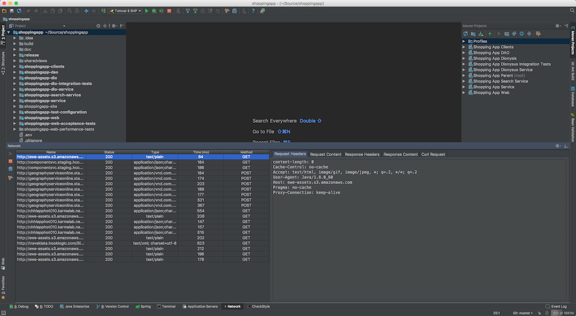
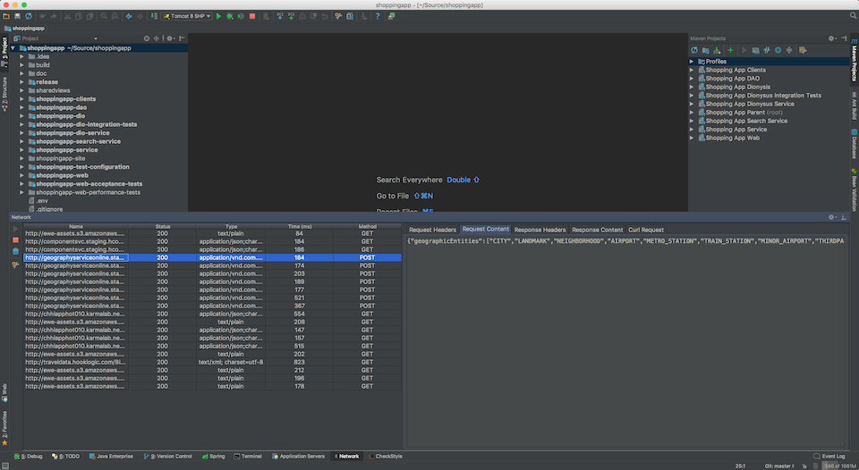
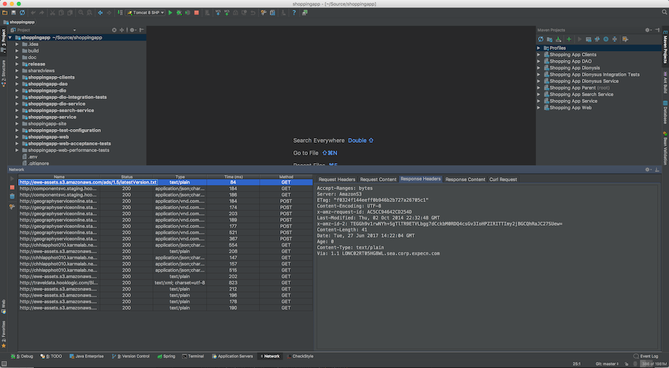
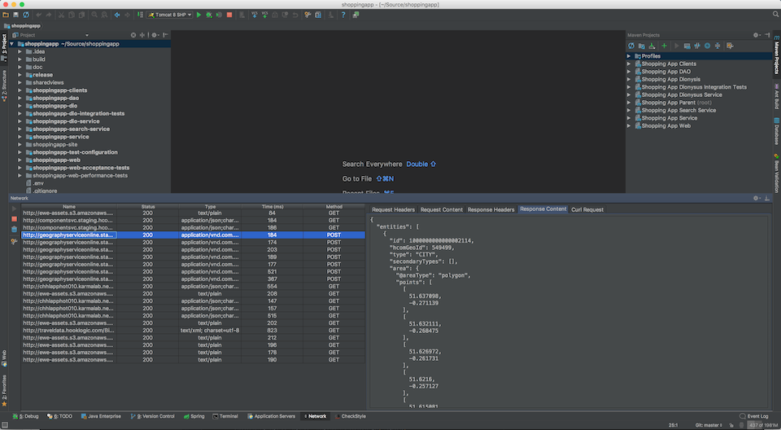
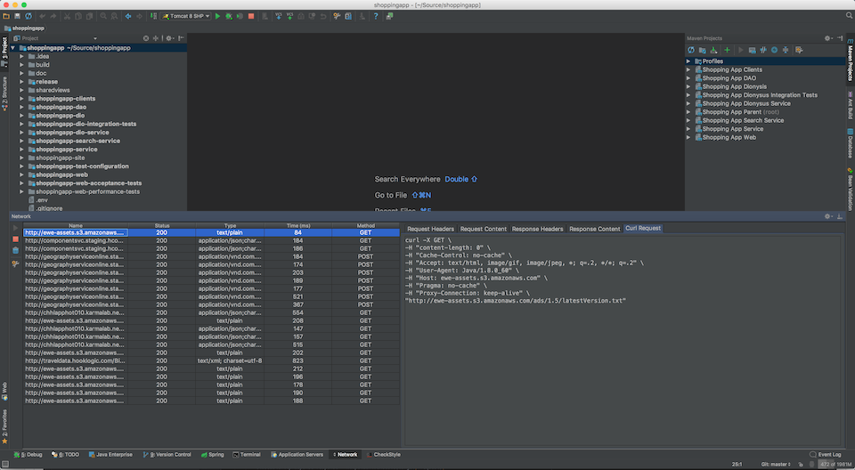
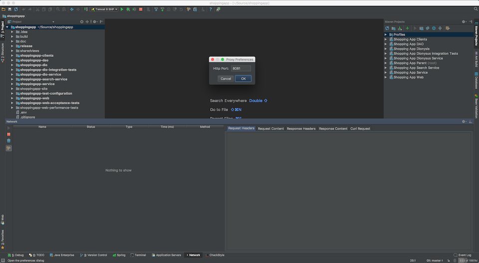

# Network Plugin

The Network plugin allows developers to proxy requests and view the request and responses in IntelliJ. 

The proxy can be configured to run on any port.

## Usage

Following the installation of the Network Plugin a new tool window is available named Network. It can be found on the bottom toolbar.

In the Network tool window four buttons are available:
<ul>
  <li>Play / Start - Start the proxy server</li>
  <li>Stop - Stop the proxy server</li>
  <li>Bin - Clear the current visible requests</li>
  <li>Settings - Set the port for the proxy server</li>
</ul>

The Network tool window has two panels, one for the visible requests & responses and another for viewing the details 
of the selected request.

The request response panel has the columns
<ul>
  <li>URL - The request URL</li>
  <li>Status - The response status</li>
  <li>Type - The Content-Type of the response</li>
  <li>Time - Response time in ms.</li>
  <li>Method - The HTTP Method</li>
</ul>

The details panel has the columns
<ul>
  <li>Request Headers</li>
  <li>Request Content</li>
  <li>Response Headers</li>
  <li>Response Content</li>
  <li>Curl Request - Reconstructed curl request</li>
</ul>

### Usage with an application

To use the proxy with an application a few startup parameters need to be set. These are standard JVM startup parameters.

When using with a JVM please configure:
<ul>
  <li>http.proxyHost</li>
  <li>http.proxyPort</li>
  <li>http.nonProxyHosts</li>
</ul>

For example:
```
java -jar my-application.jar -Dhttp.proxyHost=localhost -Dhttp.proxyPort=8080 -Dhttp.nonProxyHosts=
```

**Note**:

Not all HTTP clients respect the JVM proxy startup parameters by default.

The popular Apache [HttpCient](https://mvnrepository.com/artifact/org.apache.httpcomponents/httpclient) library, 
on which many clients are based, does not respect the JVM proxy arguments by default. 

When using an Apache HttpClient, or derivative, construct the HttpClient similar to the below:
```java
HttpClientBuilder.create()
  .useSystemProperties()
  ...
  .build()
```

**Note**:

This proxy will only work for HTTP based requests. HTTPS does not allow using a proxy in this manner.

## Screenshots

A sample request headers view:<br>
[](markdown-resources/request-headers.png)<br>

A sample request content view:<br>
[](markdown-resources/request-content.png)<br>

A sample response headers view:<br>
[](markdown-resources/response-headers.png)<br>

A sample response content view:<br>
[](markdown-resources/response-content.png)<br>

A sample curl request view:<br>
[](markdown-resources/curl-request.png)<br>

The proxy preferences dialog:<br>
[](markdown-resources/configure.png)<br>

## Building

Through IntelliJ

1. Install the ```Gradle``` plugin
2. Clone this repository locally
3. File -> New -> Project from Existing Sources... -> build.gradle (from within the network-plugin folder)
4. Change the project SDK to the bundled IntelliJ SDK


Through the command line

1. ```git clone https://github.com/HotelsDotCom/network-plugin.git```
2. ```cd network-plugin```
3. ```./gradlew clean build```

## Running

Through IntelliJ (assuming the application has been setup for building through IntelliJ)

1. Run -> Edit Configurations... -> Plus Symbol -> Grade -> Select ```network-plugin``` as the Gradle project and enter ```runIde``` as the task

## Installing

1. Preferences -> Plugins -> Install plugin from disk... -> Select the ```zip``` file created by building the Network plugin

The built ```zip``` file can be found in the ```build/distributions``` folder

## Acknowledgments

1. [LZ4](https://github.com/lz4/lz4-java)
2. [Little proxy](https://github.com/adamfisk/LittleProxy)