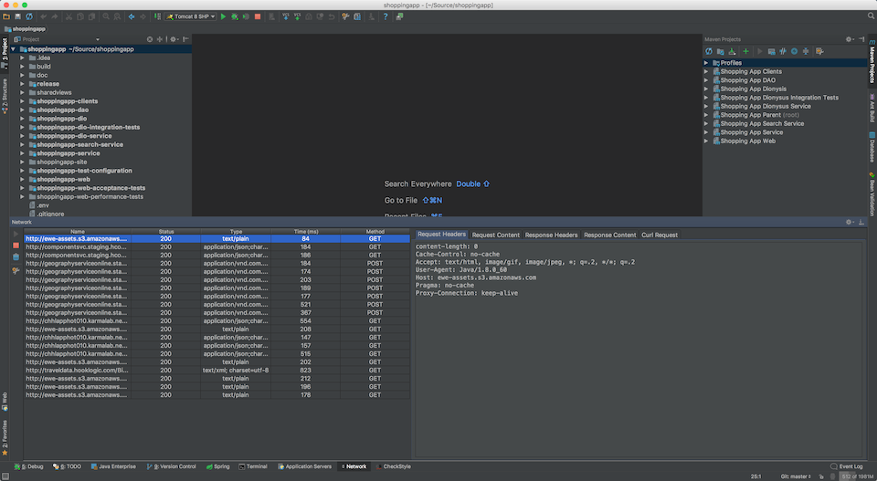
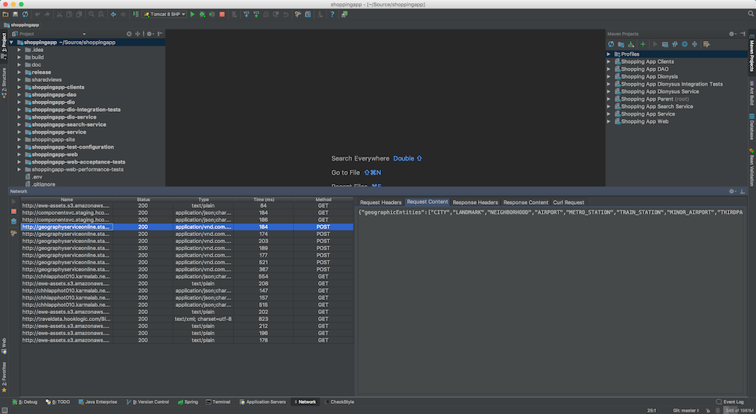
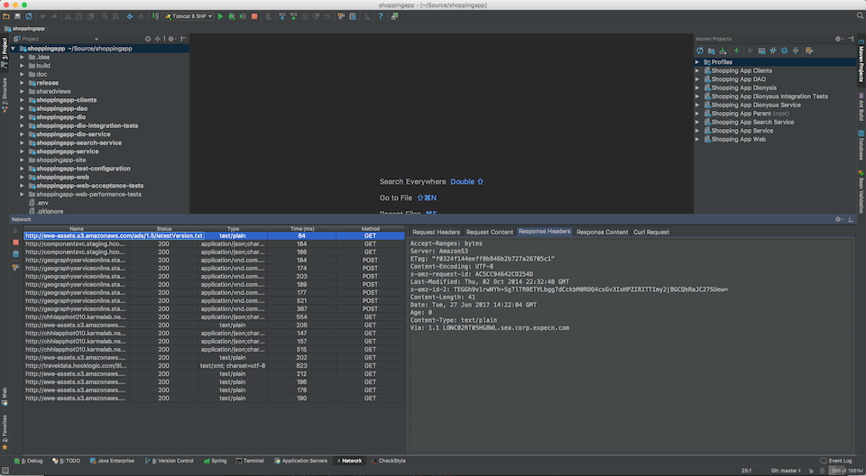
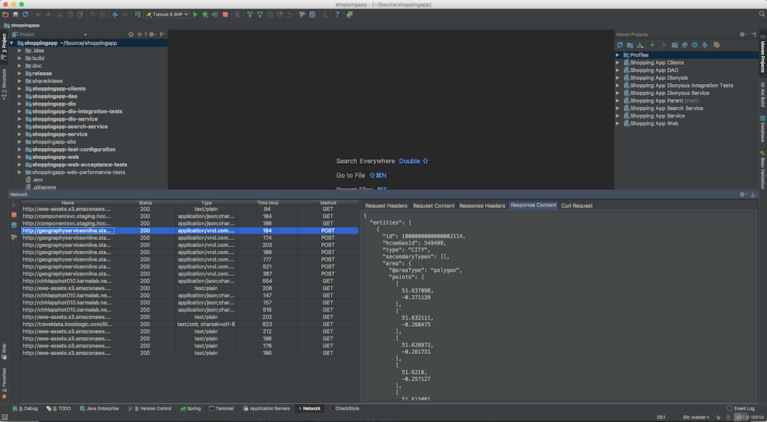

# Network

### Description
---------------

The Network plugin allows developers to proxy requests and view the request and responses in IntelliJ. The proxy may be
configured to run on any port as not to conflict with any other applications.

When using with Tomcat please configure:
```
-Dhttp.proxyHost=localhost
-Dhttp.proxyPort=8080
-Dhttp.nonProxyHosts=
```

**Note**:

Only the clients that respect the JVM args. mentioned above will use the proxy.
This proxy will only work for http based requests. Https does not allow using a proxy in this manner.

### Screenshots
---------------

A sample request headers view:<br>
[](markdown-resources/request-headers.png)

A sample request content view:<br>
[](markdown-resources/request-content.png)

A sample response headers view:<br>
[](markdown-resources/response-headers.png)

A sample response content view:<br>
[](markdown-resources/response-content.png)

A sample curl request view:<br>
[](markdown-resources/curl-request.png)

The proxy preferences dialog:<br>
[](markdown-resources/configure.png)


### Building the Network plugin
-------------------------------

1. Clone this repository locally
2. Open this folder in Idea IntelliJ CE (Download and install the community edition if you do not already have it)
3. In IntelliJ -> Right click on network-plugin.iml - > Import 'network-plugin' Module. The icon next to the root "network-plugin" folder on the project explorer should now be the plugin icon.
4. Project Structure -> Set the Project SDK to IntelliJ IDEA Community Edition
5. Project Structure -> Set the Project language level to 8
6. Project Structure -> Set the Project compiler output folder to your desired output folder e.g. New Folder -> out
7. Build -> Build Project
8. Build -> Prepare Plugin Module 'network-plugin' For Deployment

### Installing the Network Plugin
---------------------------------

1. Preferences -> Plugins -> Install plugin from disk... -> Select the zip file created by building the Network plugin

### Acknowledgments
-------------------

1. [Commons Lang3](https://mvnrepository.com/artifact/org.apache.commons/commons-lang3)
2. [LZ4](https://github.com/lz4/lz4-java)
3. [Little proxy](https://github.com/adamfisk/LittleProxy)